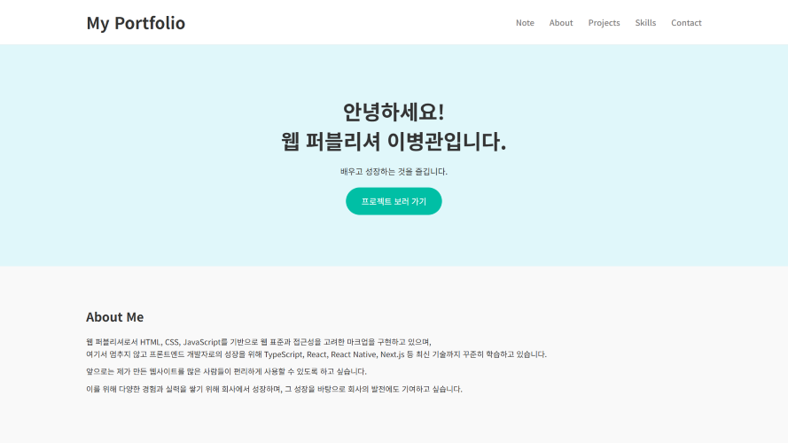

# leebg-Portfolio

개인 포트폴리오 웹사이트로 메인 페이지와 프로젝트 소개, 노트 페이지, 학습 기록 페이지로 구성되어있습니다.  
각 프로젝트는 GITHUB 저장소와 배포 링크로 연결되어 있어 코드와 결과물을 모두 확인할 수 있습니다.

---

## 미리보기

[사이트 바로가기](https://strong-cuchufli-e8731c.netlify.app/)

---

## 사용 기술

- **Frontend:** HTML5, CSS3(SCSS), JavaScript
- **Libraries:** GSAP, Swiper.js, AOS, Isotope.js
- **Tools:** Git, GitHub

---
