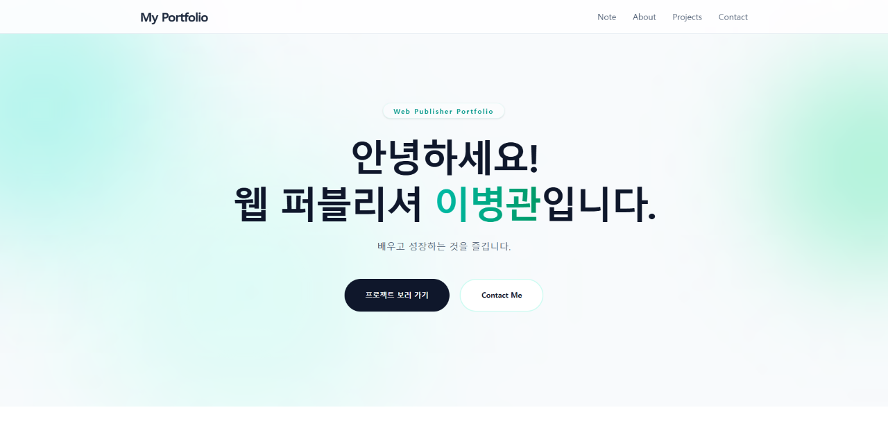

# leebg-Portfolio

개인 포트폴리오 웹사이트로 메인 페이지와 프로젝트 소개, 노트 페이지, 학습 기록 페이지로 구성되어있습니다.  
각 프로젝트는 GITHUB 저장소와 배포 링크로 연결되어 있어 코드와 결과물을 모두 확인할 수 있습니다.

---

## Preview

[포트폴리오 라이브 바로가기](https://strong-cuchufli-e8731c.netlify.app/)

---

## Tech Stack & Skill Note

상세한 기술적 구현 방식과 학습 기록은 **[Skill Note]** 페이지에 정리되어있습니다

### **Language & Style**

- **HTML5 / CSS3**
- **SCSS**
- **Javascript**

### **Libraries & UI Framework**

- **Interaction**: GSAP, AOS, Swiper.js
- **Layout**: Isotope.js
- **Tailwind CSS v4**

### **Tools**

- **Bundler**: Vite
- **Version Control**: Git, GitHub
